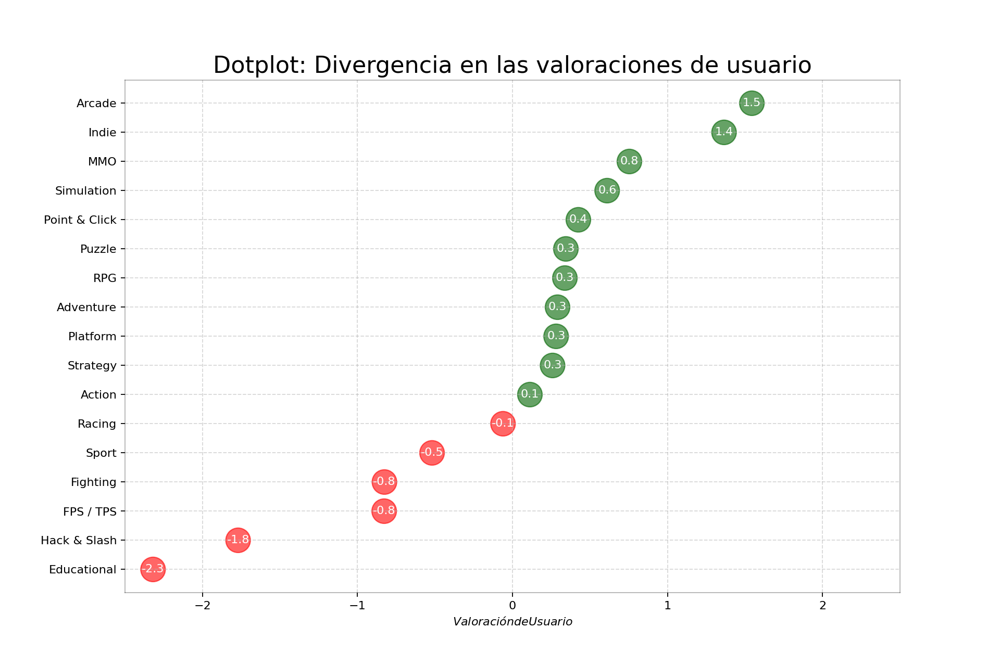

# Proyecto Analisis De Datos

## Descripción
Para obtener información sobre los diferentes datos de videojuegos que se encuentran en 
las tiendas online de páginas web se manejará el método de scraping. Para esto se utilizará 
el lenguaje de programación Ruby, un lenguaje dinámico en el cual usaremos su paradigma 
orientado a objetos enfocado a la simplicidad y productividad, esta propiedad permite que las 
clases sean privadas, además utilizaremos Python con su paradigma funcional que se basa en la
utilización de funciones que permitirán de forma rápida y sencilla obtener el código para expresar 
los datos de manera gráfica para procesar y visualizar la data con el fin de que sea más 
entendibles nuestros análisis.

## Lenguajes

- Ruby: Extracción de datos.
- Python: Gráficas de datos.

## Gráficos

Gráficos de Eneba
	
	

Gráficos de Steam
	
	

Gráficos de Fanatical
	
	
## Integrantes

- Gabriela Mora
- Sandra Loayza
- Wesley Briones